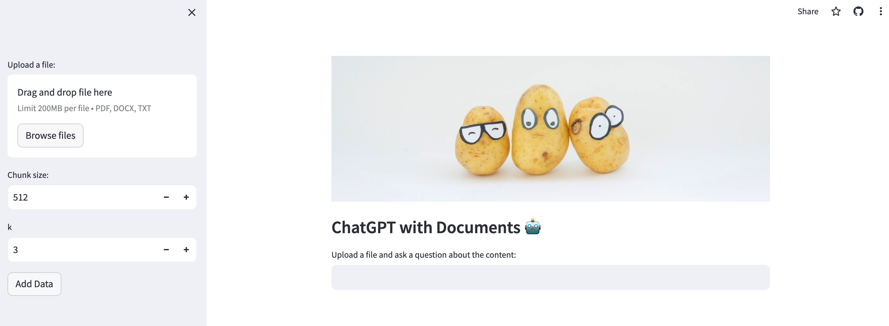

# ChatGPT with Document


## Overview

This is a demo application which demonstrates how to answer question based on the uploaded content. The interface is build with Streamlit. 


## Run the application on Streamlit Cloud

You can create the app on strealit cloud. Select the repo and the `azure` branch.

Input below environment variables and as secrets.

```
OPENAI_API_TYPE = "azure"
OPENAI_API_BASE = "https://{xxxx}.openai.azure.com/"
OPENAI_API_KEY = "xxxx"
OPENAI_API_VERSION = "xxxx"
DEPLOYMENT_NAME = "xxxx"
EMBEDDING_NAME = "azure-openai-embedding-002"
```

After the app is deployed, you should see below interface.


