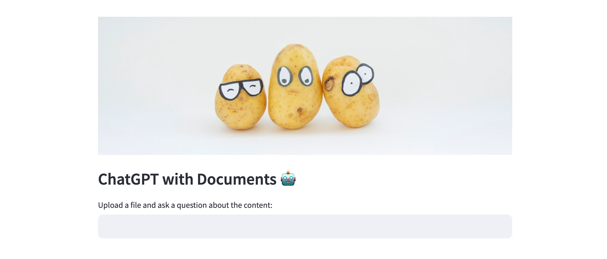
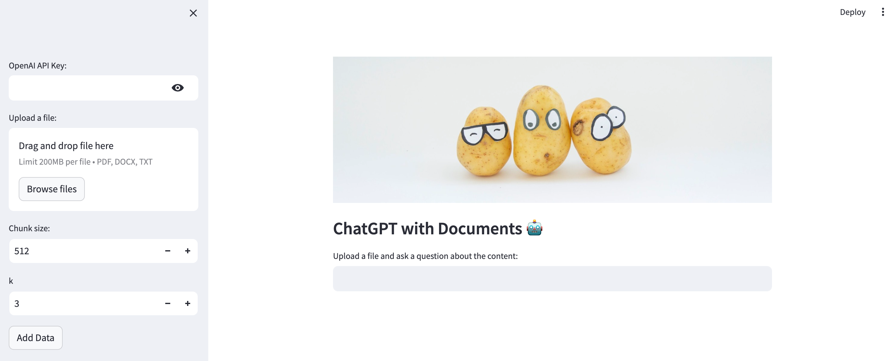

# ChatGPT with Document





## Overview

This is a demo application which demonstrates how to answer question based on the uploaded content. The interface is build with Streamlit. 


## Installation

1. Clone the repository

```bash
git clone https://github.com/BrambleXu/QA_Chatbot.git
```

2. Move to the directory

```bash
cd QA_Chatbot
```

3. Install the required packages

```bash
pip install -r requirements.txt
```

4. Run the Streamlit application

```bash
streamlit run ./main.py
```

## Usage

Once the application is running, you can interact with it by following the on-screen instructions at `http://localhost:8501`

Input OpenAI's API Key and upload a file, then ask the question about the content. You can try the files in the `files` folder.


